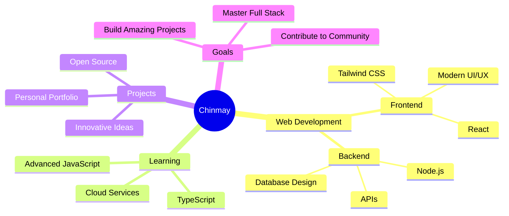

<div align="center">
  
# 👋 Hi, I'm Chinmay Jha

[](https://git.io/typing-svg)

<p align="center">
  <em>Passionate student and web developer from India 🇮🇳</em><br>
  <em>Creating digital wonders, one line of code at a time ✨</em>
</p>

[](https://chinmayjha.tech)
[](mailto:contact@chinmayjha.tech)
[](https://twitter.com/itschinmayjha)
[](https://t.me/chinmayjha)
[](https://codepen.io/itschinmayjha)


</div>

---

## 🚀 About Me

```javascript
const chinmay = {
    location: "India 🇮🇳",
    role: "Full Stack Web Developer",
    education: "Computer Science Student",
    passions: ["Web Development", "UI/UX Design", "Open Source"],
    currentFocus: "Building responsive and beautiful web applications",
    funFact: "Every line of code is a brushstroke on the canvas of innovation",
    lifePhilosophy: "Code with passion, create with purpose",
    availability: "Open for collaborations and exciting projects"
};
```

## 💻 Tech Stack

<div align="center">

### 🎨 Frontend Development


### ⚙️ Backend & Database


### 🛠️ Tools & Technologies


</div>

## 🌟 Featured Projects

<div align="center">

<table>
<tr>
<td width="50%">
<h3 align="center">🎲 Random Number Generator</h3>
<div align="center">
<a href="https://github.com/chinmayjha/Random-Number-Generator" target="_blank">

</a>
<p><strong>HTML, CSS, JavaScript</strong> - A modern, responsive web application for generating random numbers with a beautiful interface</p>
</div>
</td>
<td width="50%">
<h3 align="center">🌤️ Weather App</h3>
<div align="center">
<a href="https://github.com/chinmayjha/Weather-App" target="_blank">

</a>
<p><strong>HTML, CSS, JavaScript</strong> - Modern weather application UI with clean design and responsive layout</p>
</div>
</td>
</tr>
<tr>
<td width="50%">
<h3 align="center">⏱️ Aesthetic Stopwatch</h3>
<div align="center">
<a href="https://github.com/chinmayjha/Aesthetic-Stopwatch" target="_blank">

</a>
<p><strong>HTML, CSS, JavaScript</strong> - Beautiful glassmorphic stopwatch with lap tracking and custom themes</p>
</div>
</td>
<td width="50%">
<h3 align="center">🎵 Lyrics Card Generator</h3>
<div align="center">
<a href="https://github.com/chinmayjha/LyricsCard" target="_blank">

</a>
<p><strong>HTML, CSS, JavaScript</strong> - Create stunning Spotify-style lyrics cards with cutting-edge design</p>
</div>
</td>
</tr>
<tr>
<td width="50%">
<h3 align="center">🎮 Fan Simulator Game</h3>
<div align="center">
<a href="https://github.com/chinmayjha/Fan-Simulator-Game" target="_blank">

</a>
<p><strong>JavaScript, HTML, CSS</strong> - An interactive and fun ceiling fan simulation game</p>
</div>
</td>
<td width="50%">
<h3 align="center">🧭 Responsive Navigation Bar</h3>
<div align="center">
<a href="https://github.com/chinmayjha/Responsive-navigation-bar" target="_blank">

</a>
<p><strong>HTML, CSS, JavaScript</strong> - Navigation bar with mobile and Day/Night mode support</p>
</div>
</td>
</tr>
</table>

### 🔥 More Cool Projects
[](https://github.com/chinmayjha/Netflix-login-page-clone)
[](https://github.com/chinmayjha/Google-clone)
[](https://github.com/chinmayjha/Technoblade-Tribute)
[](https://github.com/chinmayjha/Live-time)

<a href="https://github.com/chinmayjha?tab=repositories" target="_blank">

</a>

</div>

## 📝 Latest Blog Posts

<div align="center">

### ✨ Recent Articles from My Blog

<div align="left" style="margin: 0 auto; max-width: 800px;">

<!-- BLOG-POST-LIST:START -->- 📝 <a href="https://chinmayjha.tech/blog/agentic-ai-future-coding/">Agentic AI &amp; the Future of Coding: When Software Becomes the Decision Maker</a><br>- 📝 <a href="https://chinmayjha.tech/blog/software-development-trends-2025/">Top Software Development Trends in 2025: What You Can&#39;t Ignore</a><br>- 📝 <a href="https://chinmayjha.tech/blog/hardware-scaling-ai-era/">Hardware Scaling in the AI Era: From More Transistors to Smart Chips</a><br>- 📝 <a href="https://chinmayjha.tech/blog/vibe-coding-prompt-engineering/">Vibe Coding, Prompt Engineering &amp; the New Ways to Write Software</a><br>- 📝 <a href="https://chinmayjha.tech/blog/cloud-to-edge-architecture/">From Cloud to Edge: Software Architecture for Low Latency &amp; Real-Time Systems</a><br><!-- BLOG-POST-LIST:END -->

</div>

<br>

[](https://chinmayjha.tech/blog)

</div>

## 📊 GitHub Statistics

<div align="center">
  


</div>

## 🏆 GitHub Trophies

<div align="center">
  
[](https://github.com/ryo-ma/github-profile-trophy)

</div>

## 🎯 Current Focus



## 🤝 Let's Connect!

<div align="center">

I'm always excited to connect with fellow developers, collaborate on projects, or just have a chat about technology and innovation!

[](https://chinmayjha.tech)
[](mailto:contact@chinmayjha.tech)
[](https://twitter.com/itschinmayjha)
[](https://t.me/chinmayjha)
[](https://codepen.io/itschinmayjha)

### ☕ Support My Work

If you like what I do and want to support my work, consider buying me a coffee!

[](https://buymeacoffee.com/chinmayjha)

</div>

---

<div align="center">
  
### 💭 Quote of the Day


### 🎵 Now Playing

[](https://open.spotify.com/user/31e53lkwnl43mzymv42vudlewfmy)

<p>
  <em>"The best way to predict the future is to create it."</em>
</p>

---

**Made with ♥ by Chinmay**

</div>
